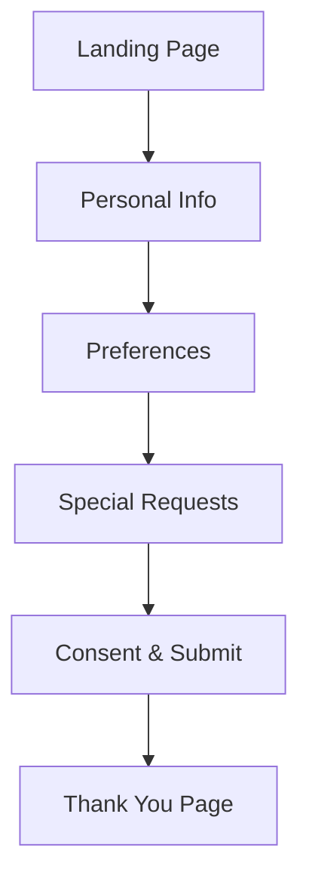

# Luxury Morocco Travel Pre-Arrival Form Design Specification

## Overview
This document outlines the design specification for a customized online form tailored for luxury tourism and B2B travel clients visiting Morocco. The form will be sent pre-arrival to gather client needs and inquiries, accommodating individuals, groups, or families. It includes integration with Salesforce for auto-filling names and contacts, ensures data security, ease of access for employees, and is owned solely by the company (CARDEX).

## Target Audience
- High-end travelers expecting a seamless, luxurious experience.
- B2B clients for corporate travel.
- Individuals, families, and groups.

## Objectives
- Provide a user-friendly, professional interface reflecting the CARDEX brand.
- Gather essential pre-arrival information efficiently.
- Ensure mobile responsiveness and visual appeal.
- Maintain data security and company ownership.
- Align with commitment to exceptional service.

## Brand Guidelines
- **Colors**: Burgundy (#800020), cream (#FFFDD0), and gold (#FFD700).
- **Logo**: Riad facade stylized icon.
- **Typography**: Traditional Arabic-inspired fonts (e.g., Amiri for headings, Noto Sans Arabic for body text).
- **Style**: Elegant, luxurious, with Moroccan cultural elements (e.g., subtle patterns, arches).

## Form Structure and Sections

### 1. Introduction/Landing Page
- Welcome message: "Welcome to CARDEX Luxury Morocco Experiences. Please fill out this form to personalize your journey."
- Brand logo and tagline.
- Progress indicator (e.g., step 1 of 4).
- Auto-fill prompt: "If you have a Salesforce account, your details may be pre-filled."

### 2. Personal Information Section
- Fields:
  - Full Name (text, auto-filled from Salesforce)
  - Email (email, auto-filled)
  - Phone Number (tel, auto-filled)
  - Group Type: Individual / Family / Group (radio buttons)
  - Number of Travelers (number, conditional on group type)
  - Arrival Date (date)
  - Departure Date (date)
- Validation: Required fields marked with *.

### 3. Preferences Section
- Fields:
  - Dietary Restrictions (multi-select: Vegetarian, Vegan, Halal, Gluten-Free, Allergies - specify)
  - Accessibility Needs (checkboxes: Wheelchair access, Mobility assistance, etc.)
  - Preferred Language (dropdown: English, French, Arabic, Spanish)
  - Accommodation Preferences (radio: Luxury Riad, Boutique Hotel, Private Villa)
  - Transportation Needs (checkboxes: Private chauffeur, Helicopter transfer, etc.)
- Conditional logic: Show additional fields based on selections.

### 4. Special Requests Section
- Fields:
  - Custom Activities (textarea: e.g., Private cooking class, Desert safari)
  - Food Preferences (textarea: Specific cuisines or dishes)
  - Additional Inquiries (textarea: Any other needs or questions)
- Optional file upload: Attach documents if needed (e.g., passport copy).

### 5. Consent and Submission
- Data consent checkbox: "I agree to the processing of my data in accordance with GDPR."
- Submit button: "Submit My Preferences" (gold background, burgundy text).
- Thank you page: Confirmation message with next steps.

## User Flow

## UI/UX Design
- **Layout**: Single-page form with sections in collapsible accordions or step-by-step wizard.
- **Visual Elements**:
  - Background: Subtle Moroccan pattern in cream and gold.
  - Form fields: Rounded corners, burgundy borders on focus.
  - Buttons: Gold with hover effects.
  - Icons: Elegant icons for each section (e.g., user icon for personal info).
- **Typography**: Headings in Amiri (bold, 24px), body in Noto Sans Arabic (16px).
- **Spacing**: Generous padding, 20px margins.
- **Error Handling**: Inline validation with red text for errors.
- **Loading States**: Spinner on submit.

## Mobile Responsiveness
- Responsive grid: 1 column on mobile, 2 on tablet, 3 on desktop.
- Touch-friendly: Large buttons (44px min height), swipe navigation for steps.
- Optimized for iOS/Android: Native date pickers, keyboard types.

## Accessibility
- WCAG 2.1 AA compliant: Alt text for images, high contrast ratios.
- Screen reader support: ARIA labels.
- Keyboard navigation: Tab order logical.

## Integration with Salesforce
- API-based integration using Salesforce REST API.
- Auto-fill: On form load, query Salesforce for user data using OAuth (placeholders for Client ID/Secret).
- Submission: Post form data to Salesforce Lead/Contact objects.
- Security: Encrypted API calls, token-based authentication.

## Data Security
- HTTPS/SSL encryption.
- Data minimization: Collect only necessary fields.
- Consent forms for GDPR compliance.
- Server-side validation and sanitization.
- No third-party tracking without consent.

## Ownership and Hosting
- Hosted on CARDEX domain (e.g., form.cardex.ma).
- Company-controlled servers, no external dependencies.
- Employee access: Admin dashboard for viewing submissions (password-protected).

## Technical Considerations
- Framework: HTML5, CSS3, JavaScript (vanilla or React for interactivity).
- Backend: Node.js or PHP for form handling and Salesforce API.
- Database: Secure storage for form data, linked to Salesforce.
- Testing: Cross-browser, mobile device testing.

## Implementation Plan
1. Wireframe creation.
2. Prototype development.
3. Integration testing with Salesforce sandbox.
4. Security audit.
5. Deployment on CARDEX domain.

## Conclusion
This specification ensures a seamless, secure, and luxurious form experience aligned with CARDEX's brand and service commitment. Further refinements can be made based on feedback.